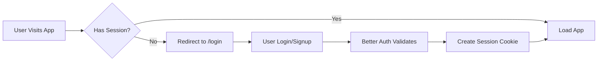

# Cursor Agent Manager

<div align="center">

**Manage your Cursor background agents on the go** 🚀

A mobile-first Next.js application for managing Cursor background agents from anywhere. Built with modern web technologies and designed for developers who need to monitor and control their AI agents while away from their desk.

[](https://nextjs.org)
[](https://www.typescriptlang.org/)
[](https://opensource.org/licenses/MIT)

[Features](#features) • [Quick Start](#quick-start) • [Documentation](#documentation) • [Deployment](#deployment)

</div>

---

## ✨ Features

### 🔐 Authentication & Security
- **Secure Authentication**: Email/password auth powered by Better Auth
- **Encrypted Storage**: API keys encrypted with AES-256-GCM before database storage
- **Session Management**: HTTP-only cookies with 7-day expiry
- **Route Protection**: Middleware-based authentication for all routes

### 💾 Database-Backed
- **User Data Persistence**: All preferences, repositories, and branches stored in Turso SQLite
- **Per-User API Keys**: Each user has their own encrypted Cursor API key
- **Auto-Migration**: Seamlessly migrates data from localStorage to database
- **Fast & Scalable**: Edge-ready database with global replication

### 🎨 User Experience
- **Mobile-First Design**: Optimized 448px centered layout for mobile devices
- **Simulation Mode**: Try the app without a Cursor API key using realistic mock data
- **Real-time Updates**: React Query with optimistic updates and smart caching
- **Theme Support**: Dark/light/system theme modes with no flash on load
- **Responsive UI**: Works beautifully on phones, tablets, and desktops

### 🛠️ Developer Features
- **Type-Safe**: Full TypeScript coverage with strict mode
- **Modern Stack**: Next.js 16 App Router, React 19, Tailwind CSS 4
- **Fast Runtime**: Built with Bun for lightning-fast installs and builds
- **Database Migrations**: Drizzle ORM with version-controlled schema changes

## 📚 Table of Contents

- [Features](#-features)
- [Tech Stack](#-tech-stack)
- [Quick Start](#-quick-start)
- [Environment Setup](#-environment-setup)
- [Architecture](#-architecture)
- [Available Scripts](#-available-scripts)
- [Project Structure](#-project-structure)
- [Deployment](#-deployment)
- [Troubleshooting](#-troubleshooting)
- [Contributing](#-contributing)

## 🛠️ Tech Stack

| Category | Technology |
|----------|-----------|
| **Framework** | Next.js 16 (App Router) |
| **UI Library** | React 19 |
| **Styling** | Tailwind CSS 4, Radix UI |
| **Authentication** | Better Auth |
| **Database** | Drizzle ORM + Turso (SQLite) |
| **State Management** | TanStack React Query |
| **Forms** | TanStack React Form |
| **Runtime** | Bun |
| **Language** | TypeScript 5.0 |
| **Deployment** | Vercel (recommended) |

## 🚀 Quick Start

**Get up and running in 5 minutes!**

### Prerequisites

- [Bun](https://bun.sh) v1.2.16+ installed
- [Turso](https://turso.tech) account (free tier available)

### One-Command Setup

```bash
# Clone, install, and setup
git clone <repository-url> && cd cursor-agents-manager && bun install
```

### Configuration Steps

1️⃣ **Create Turso Database**
```bash
turso db create cursor-auth-db
```

2️⃣ **Get Database Credentials**
```bash
# Get database URL
turso db show cursor-auth-db --url

# Get auth token
turso db tokens create cursor-auth-db
```

3️⃣ **Setup Environment Variables**

```bash
cp .env.example .env.local
# Edit .env.local with your credentials
```

See [Environment Setup](#-environment-setup) for details

4️⃣ **Initialize Database**
```bash
bun run db:push
```

5️⃣ **Start Development Server**
```bash
bun run dev
```

🎉 **Open [http://localhost:3000](http://localhost:3000)** and create your account!

## ⚙️ Environment Setup

### Quick Setup

Copy the example file and fill in your values:

```bash
cp .env.example .env.local
```

### Environment Variables

Your `.env.local` should contain:

```bash
# Turso Database (Auth DB - Shared)
TURSO_AUTH_DATABASE_URL=libsql://your-auth-db.turso.io
TURSO_AUTH_TOKEN=your-auth-token

# Turso API (for database management)
TURSO_ORG_NAME=your-org-name
TURSO_API_TOKEN=your-turso-api-token

# Better Auth
BETTER_AUTH_SECRET=your-random-secret-min-32-chars
ENCRYPTION_SECRET=your-encryption-secret-min-32-chars

# App URL
NEXT_PUBLIC_APP_URL=http://localhost:3000

# Optional: Your Cursor API key (can also be set per-user in the app)
CURSOR_API_KEY=your-cursor-api-key
```

### Getting Turso Credentials

1. Install Turso CLI:
```bash
curl -sSfL https://get.tur.so/install.sh | bash
```

2. Create an account and login:
```bash
turso auth signup
turso auth login
```

3. Create your auth database:
```bash
turso db create cursor-auth-db
```

4. Get your database URL:
```bash
turso db show cursor-auth-db --url
```

5. Create a database token:
```bash
turso db tokens create cursor-auth-db
```

6. Get your API token for database management:
```bash
turso auth token
```

### 🔑 Generating Secrets

Generate secure random secrets for `BETTER_AUTH_SECRET` and `ENCRYPTION_SECRET`:

```bash
# macOS/Linux
openssl rand -base64 32

# Or use Node.js
node -e "console.log(require('crypto').randomBytes(32).toString('base64'))"
```

> **⚠️ Important**: Never commit `.env.local` to version control. It's already in `.gitignore`.

## 🏗️ Architecture

### 🔄 Authentication Flow



**Flow Details**:
1. User registers via `/signup` with email/password
2. Better Auth hashes password (bcrypt) and creates user record
3. Session created with 7-day expiry, stored as HTTP-only cookie
4. Middleware validates session on every request
5. Unauthenticated users redirected to `/login?callbackUrl=<path>`

### 💾 Database Schema

**Single Shared Database** (Turso SQLite):

| Table | Purpose | Key Fields |
|-------|---------|-----------|
| `user` | User accounts | id, email, name, emailVerified |
| `session` | Active sessions | id, userId, expiresAt, token |
| `account` | Auth credentials | userId, password (hashed) |
| `user_api_keys` | Encrypted Cursor API keys | userId, encryptedApiKey |
| `repositories` | User's GitHub repos | userId, url, name |
| `branches` | User's branch names | userId, name |
| `user_settings` | User preferences | userId, key, value |

🔗 All user tables have `userId` foreign keys with cascade delete

### 🎭 Simulation vs Live Mode

| Mode | Trigger | Data Source | Use Case |
|------|---------|-------------|----------|
| **Simulation** | No API key configured | Mock data (`lib/mock-data.ts`) | Demo, testing, development |
| **Live** | Valid API key in DB | Cursor API (`api.cursor.com/v0/agents`) | Production use |

**Mode Detection**: `lib/api-utils.ts:isSimulationMode()`
- Checks user session from request headers
- Queries `user_api_keys` table for encrypted API key
- Validates key length and content
- Returns boolean for mode selection

## 📜 Available Scripts

| Command | Description |
|---------|-------------|
| `bun run dev` | Start development server on port 3000 |
| `bun run build` | Create production build |
| `bun run start` | Start production server |
| `bun run lint` | Run ESLint for code quality |
| `bun run db:generate` | Generate Drizzle migrations from schema changes |
| `bun run db:push` | Push migrations to Turso database |
| `bun run db:studio` | Open Drizzle Studio (database GUI) |

### Development Workflow

```bash
# Make changes to schema files
nano lib/schema/auth-schema.ts

# Generate migration
bun run db:generate

# Apply migration to database
bun run db:push

# Start dev server
bun run dev
```

## 📁 Project Structure

```
cursor-agents-manager/
├── 📱 app/                       # Next.js App Router
│   ├── 🔐 login/                 # Login page
│   ├── 🔐 signup/                # Signup page
│   ├── 🏠 page.tsx               # Agent list (home)
│   ├── ➕ new/                   # Launch new agent
│   ├── 👤 account/               # Account management
│   ├── ⚙️ settings/              # User settings
│   ├── 🤖 agent/[id]/            # Agent detail view
│   └── 🔌 api/                   # API Routes
│       ├── auth/[...all]/        # Better Auth endpoints
│       ├── agents/               # Agent operations
│       └── user/                 # User data endpoints
│           ├── api-key/          # API key CRUD
│           ├── repositories/     # Repo CRUD
│           └── branches/         # Branch CRUD
│
├── 🎨 components/                # React Components
│   ├── ui/                       # Radix UI primitives
│   ├── api-key-manager.tsx       # API key manager UI
│   ├── account-screen.tsx        # Account page
│   └── settings-form.tsx         # Settings form
│
├── 📚 lib/                       # Core Logic
│   ├── 🔐 auth.ts                # Better Auth config
│   ├── 🔐 auth-client.ts         # Client-side auth
│   ├── 💾 db.ts                  # Database connection
│   ├── 🔒 encryption.ts          # AES-256-GCM crypto
│   ├── 🛠️ api-utils.ts           # API helpers
│   ├── 📊 schema/                # Database Schemas
│   │   ├── auth-schema.ts        # Auth tables
│   │   └── user-schema.ts        # User data tables
│   └── 🪝 hooks/                 # React Query Hooks
│       ├── use-session.ts        # Session hook
│       ├── use-repositories.ts   # Repos hook
│       └── use-branches.ts       # Branches hook
│
├── 🗄️ drizzle/                   # Database migrations
├── 🛡️ middleware.ts              # Route protection
└── ⚙️ drizzle.config.ts          # Drizzle config
```

### Key Files

| File | Purpose |
|------|---------|
| `middleware.ts` | Protects routes, validates sessions |
| `lib/auth.ts` | Better Auth server configuration |
| `lib/encryption.ts` | Encrypts/decrypts API keys |
| `lib/api-utils.ts` | Simulation mode detection |
| `drizzle.config.ts` | Database connection config |

## 🔒 Security

This application implements multiple layers of security:

| Layer | Implementation | Details |
|-------|---------------|---------|
| **Passwords** | Bcrypt hashing | Handled by Better Auth, industry-standard |
| **Sessions** | HTTP-only cookies | 7-day expiry, secure flag in production |
| **API Keys** | AES-256-GCM encryption | Encrypted before storage, decrypted on use |
| **SQL Injection** | Parameterized queries | Drizzle ORM prevents injection attacks |
| **HTTPS** | TLS/SSL | Enforced by Vercel in production |
| **CSRF Protection** | Token validation | Built into Better Auth |
| **XSS Protection** | React sanitization | Automatic by React/Next.js |

### Security Best Practices

✅ Never commit `.env.local` to version control
✅ Rotate `ENCRYPTION_SECRET` and `BETTER_AUTH_SECRET` regularly
✅ Use strong passwords (enforced: 8+ characters)
✅ Enable 2FA in Better Auth (optional plugin)
✅ Monitor Turso database access logs
✅ Keep dependencies updated (`bun update`)

## 🚀 Deployment

### Vercel (Recommended)

**One-Click Deploy:**

[](https://vercel.com/new/clone?repository-url=https://github.com/YOUR_USERNAME/cursor-agents-manager)

**Manual Deployment:**

1️⃣ **Push to GitHub**
```bash
git push origin main
```

2️⃣ **Import to Vercel**
- Go to [vercel.com](https://vercel.com)
- Click "Add New" → "Project"
- Import your GitHub repository

3️⃣ **Configure Environment Variables**

Add all variables from `.env.local` to Vercel:
- `TURSO_AUTH_DATABASE_URL`
- `TURSO_AUTH_TOKEN`
- `TURSO_ORG_NAME`
- `TURSO_API_TOKEN`
- `BETTER_AUTH_SECRET`
- `ENCRYPTION_SECRET`
- `NEXT_PUBLIC_APP_URL` (set to your Vercel domain)

4️⃣ **Deploy**
- Click "Deploy"
- Wait for build to complete
- Visit your live site!

### Post-Deployment Checklist

- [ ] Verify `NEXT_PUBLIC_APP_URL` is set correctly
- [ ] Test signup flow
- [ ] Test login flow
- [ ] Configure your Cursor API key in the app
- [ ] Test agent operations
- [ ] Check Turso database in Drizzle Studio

## 🐛 Troubleshooting

### Common Issues

#### Build Errors

**Issue**: `Module not found` errors during build
```bash
# Solution: Clear cache and reinstall
rm -rf node_modules .next
bun install
bun run build
```

**Issue**: TypeScript errors during build
```bash
# Temporary: Set ignoreBuildErrors in next.config.mjs (not recommended)
# Better: Fix the TypeScript errors
```

#### Database Issues

**Issue**: `LibsqlError: SQLITE_READONLY`
```bash
# Solution: Check your Turso auth token has write permissions
turso db tokens create cursor-auth-db
```

**Issue**: Migration errors
```bash
# Solution: Reset and regenerate migrations
rm -rf drizzle/
bun run db:generate
bun run db:push
```

#### Authentication Issues

**Issue**: "Unauthorized" errors
```bash
# Solution: Check your session cookie settings
# Ensure NEXT_PUBLIC_APP_URL matches your domain
```

**Issue**: Can't login after signup
```bash
# Solution: Check Better Auth configuration
# Verify database has user and session tables
```

#### API Key Issues

**Issue**: Simulation mode even with API key set
```bash
# Solution: Verify API key in database is valid
# Check encryption/decryption is working
# Ensure API key is > 10 characters
```

### Debug Mode

Enable debug logging:

```bash
# .env.local
DEBUG=better-auth:*
NODE_ENV=development
```

### Getting Help

- 📖 Check [CLAUDE.md](./CLAUDE.md) for detailed architecture
- 🐛 [Open an issue](https://github.com/YOUR_USERNAME/cursor-agents-manager/issues)
- 💬 Join discussions in GitHub Discussions

## 🤝 Contributing

We welcome contributions! Here's how to get started:

### Development Setup

1. Fork the repository
2. Clone your fork
3. Create a new branch: `git checkout -b feature/amazing-feature`
4. Make your changes
5. Test thoroughly
6. Commit: `git commit -m 'Add amazing feature'`
7. Push: `git push origin feature/amazing-feature`
8. Open a Pull Request

### Contribution Guidelines

- ✅ Follow existing code style (TypeScript, ESLint)
- ✅ Write meaningful commit messages
- ✅ Update documentation if needed
- ✅ Test your changes locally
- ✅ Keep PRs focused and small
- ✅ Add comments for complex logic

### Areas for Contribution

- 🐛 Bug fixes
- ✨ New features
- 📝 Documentation improvements
- 🎨 UI/UX enhancements
- ♿ Accessibility improvements
- 🌍 Internationalization (i18n)
- 🧪 Test coverage

## 📚 Documentation

- **[CLAUDE.md](./CLAUDE.md)** - Comprehensive architecture and implementation guide
- **[AGENTS.md](./AGENTS.md)** - Copy of CLAUDE.md for reference
- **[Drizzle Docs](https://orm.drizzle.team/docs/overview)** - Database ORM documentation
- **[Better Auth Docs](https://www.better-auth.com/docs)** - Authentication documentation
- **[Turso Docs](https://docs.turso.tech)** - Database platform documentation

## 📄 License

This project is licensed under the MIT License - see the [LICENSE](LICENSE) file for details.

## 🙏 Acknowledgments

- Built with [Next.js](https://nextjs.org) by Vercel
- Authentication by [Better Auth](https://www.better-auth.com)
- Database by [Turso](https://turso.tech)
- ORM by [Drizzle](https://orm.drizzle.team)
- UI components by [Radix UI](https://www.radix-ui.com)

---

<div align="center">

**Made with ❤️ for developers managing Cursor agents**

[⭐ Star this repo](https://github.com/YOUR_USERNAME/cursor-agents-manager) • [🐛 Report Bug](https://github.com/YOUR_USERNAME/cursor-agents-manager/issues) • [✨ Request Feature](https://github.com/YOUR_USERNAME/cursor-agents-manager/issues)

</div>
