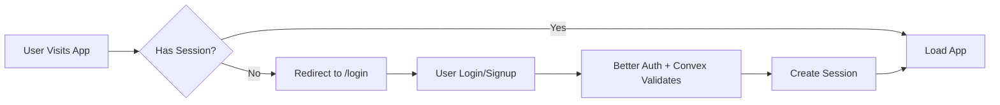

# Cursor Agent Manager

<div align="center">

**Manage your Cursor background agents on the go** 🚀

A mobile-first Next.js application for managing Cursor background agents from anywhere. Built with modern web technologies and designed for developers who need to monitor and control their AI agents while away from their desk.

[](https://nextjs.org)
[](https://www.typescriptlang.org/)
[](https://opensource.org/licenses/MIT)

[Features](#features) • [Quick Start](#quick-start) • [Documentation](#documentation) • [Deployment](#deployment)

</div>

---

## ✨ Features

### 🔐 Authentication & Security
- **Secure Authentication**: Email/password auth powered by Better Auth + Convex
- **Encrypted Storage**: API keys encrypted with AES-256-GCM before database storage
- **Session Management**: Secure sessions with automatic expiry
- **Route Protection**: Middleware-based authentication for all routes

### 💾 Convex Backend
- **Real-time Data**: Convex provides reactive queries with automatic UI updates
- **Per-User API Keys**: Each user has their own encrypted Cursor API key
- **Serverless Functions**: Backend logic runs as Convex actions and mutations
- **Type-Safe**: End-to-end type safety from database to frontend

### 🎨 User Experience
- **Mobile-First Design**: Optimized 448px centered layout for mobile devices
- **Simulation Mode**: Try the app without a Cursor API key using realistic mock data
- **Real-time Updates**: Convex reactive queries with optimistic updates
- **Theme Support**: Dark/light/system theme modes with no flash on load
- **Responsive UI**: Works beautifully on phones, tablets, and desktops

### 🛠️ Developer Features
- **Type-Safe**: Full TypeScript coverage with strict mode
- **Modern Stack**: Next.js 16 App Router, React 19, Tailwind CSS 4
- **Fast Runtime**: Built with Bun for lightning-fast installs and builds
- **Convex Backend**: Serverless database and functions with real-time sync

## 📚 Table of Contents

- [Features](#-features)
- [Tech Stack](#-tech-stack)
- [Quick Start](#-quick-start)
- [Environment Setup](#-environment-setup)
- [Architecture](#-architecture)
- [Available Scripts](#-available-scripts)
- [Project Structure](#-project-structure)
- [Deployment](#-deployment)
- [Troubleshooting](#-troubleshooting)
- [Contributing](#-contributing)

## 🛠️ Tech Stack

| Category | Technology |
|----------|-----------|
| **Architecture** | Bun Monorepo with Workspaces |
| **Framework** | Next.js 16 (App Router) |
| **UI Library** | React 19 |
| **Styling** | Tailwind CSS 4, Base UI |
| **Authentication** | Better Auth + Convex |
| **Backend** | Convex (database, functions, real-time) |
| **State Management** | TanStack React Query + Convex |
| **Forms** | TanStack React Form |
| **Runtime** | Bun |
| **Language** | TypeScript 5.0 |
| **Deployment** | Vercel + Convex |

## 🚀 Quick Start

**Get up and running in 5 minutes!**

### Prerequisites

- [Bun](https://bun.sh) v1.2.16+ installed
- [Convex](https://convex.dev) account (free tier available)

### One-Command Setup

```bash
# Clone, install, and setup
git clone <repository-url> && cd cursor-agents-manager && bun install
```

### Configuration Steps

1️⃣ **Setup Convex**
```bash
bunx convex dev
```
This will prompt you to create a Convex project and generate your environment variables.

2️⃣ **Setup Environment Variables**

```bash
cp .env.example .env.local
# Edit .env.local with your credentials
```

See [Environment Setup](#-environment-setup) for details

3️⃣ **Start Development Server**
```bash
bun run dev
```

🎉 **Open [http://localhost:3000](http://localhost:3000)** and create your account!

## ⚙️ Environment Setup

### Quick Setup

Copy the example file and fill in your values:

```bash
cp .env.example .env.local
```

### Environment Variables

Your `.env.local` should contain:

```bash
# Convex
# Get these from: bunx convex dev (auto-generated)
CONVEX_DEPLOYMENT=dev:your-deployment-name
NEXT_PUBLIC_CONVEX_URL=https://your-deployment.convex.cloud
NEXT_PUBLIC_CONVEX_SITE_URL=https://your-deployment.convex.site

# Encryption
# Used for encrypting API keys stored in Convex
# Generate with: openssl rand -base64 32
ENCRYPTION_SECRET=your-encryption-secret-min-32-chars

# Note: Cursor Webhook variables are set in Convex Dashboard, not .env.local
# See "Convex Dashboard Environment Variables" section below
```

### Convex Dashboard Environment Variables

Set these in your Convex dashboard (Settings → Environment Variables):

| Variable | Purpose |
|----------|---------|
| `SITE_URL` | Your app URL (e.g., `http://localhost:3000` for dev) |
| `ENCRYPTION_SECRET` | Same as your local encryption secret |
| `CURSOR_WEBHOOK_URL` | Your Convex webhook endpoint (e.g., `https://your-deployment.convex.site/webhooks/cursor`) |
| `CURSOR_WEBHOOK_SECRET` | Secret for webhook signature verification (generate with `openssl rand -hex 32`) |

**Note on Webhooks**: Webhooks are automatically included in agent launch requests when `CURSOR_WEBHOOK_URL` is configured. The webhook URL should point to your Convex deployment's `/webhooks/cursor` endpoint. You can find your Convex site URL in your `.env.local` as `NEXT_PUBLIC_CONVEX_SITE_URL`, or in the Convex dashboard. The same secret value should be used for `CURSOR_WEBHOOK_SECRET` - it's used to verify that incoming webhook requests are authentically from Cursor.

### 🔑 Generating Secrets

Generate secure random secrets for `ENCRYPTION_SECRET` and `CURSOR_WEBHOOK_SECRET`:

```bash
# For ENCRYPTION_SECRET (base64)
# macOS/Linux
openssl rand -base64 32

# Or use Node.js
node -e "console.log(require('crypto').randomBytes(32).toString('base64'))"

# For CURSOR_WEBHOOK_SECRET (hex - recommended for webhooks)
openssl rand -hex 32
```

> **⚠️ Important**: Never commit `.env.local` to version control. It's already in `.gitignore`.

## 🏗️ Architecture

### 🔄 Authentication Flow


```mermaid
graph LR
    A[User Visits App] --> B{Has Session?}
    B -->|No| C[Redirect to /login]
    B -->|Yes| D[Load App]
    C --> E[User Login/Signup]
    E --> F[Better Auth + Convex Validates]
    F --> G[Create Session]
    G --> D
```

**Flow Details**:
1. User registers via `/signup` with email/password
2. Better Auth (via Convex) hashes password and creates user record
3. Session created and managed by Convex
4. Middleware validates session on every request
5. Unauthenticated users redirected to `/login?callbackUrl=<path>`

### 💾 Convex Schema

**Convex Tables** (defined in `convex/schema.ts`):

| Table | Purpose | Key Fields |
|-------|---------|-----------|
| `agents` | Cached agent data from Cursor API | agentId, userId, status, name |
| `apiKeys` | Encrypted API keys | userId, encryptedCursorApiKey |
| `repositories` | User's GitHub repos | userId, url, name |
| `branches` | User's branch names | userId, name |
| `timeLogs` | Task time tracking | userId, agentId, activityType |

🔗 All tables use `userId` for user association

### 🎭 Simulation vs Live Mode

| Mode | Trigger | Data Source | Use Case |
|------|---------|-------------|----------|
| **Simulation** | No API key configured | Mock data (`lib/mock-data.ts`) | Demo, testing, development |
| **Live** | Valid API key in Convex | Cursor API (`api.cursor.com/v0/agents`) | Production use |

**Mode Detection**: Convex actions check for encrypted API key and determine mode automatically.

## 📜 Available Scripts

| Command | Description |
|---------|-------------|
| `bun run dev` | Start development server on port 3000 |
| `bun run build` | Create production build |
| `bun run start` | Start production server |
| `bun run lint` | Run Biome for code quality |
| `bun run lint:fix` | Auto-fix linting and formatting issues |
| `bun run test` | Run tests (Vitest + convex-test) |
| `bun run test:watch` | Run tests in watch mode |

### Development Workflow

```bash
# Start both Next.js and Convex dev servers together (recommended)
bun run dev

# Or run individually in separate terminals:
bun run dev:web    # Next.js only (apps/web)
bun run dev:db     # Convex only (packages/db)
```

The unified `bun run dev` command uses `scripts/dev.ts` to spawn both servers in parallel.

## 📁 Project Structure

This is a **Bun monorepo** with the following structure:

```
cursor-agents-manager/
├── 📱 apps/web/                  # Next.js Web Application
│   ├── app/                      # Next.js App Router
│   │   ├── (authenticated)/      # Pages requiring login
│   │   │   ├── page.tsx          # Agent list (home)
│   │   │   ├── new/              # Launch new agent
│   │   │   ├── agent/[id]/       # Agent detail view
│   │   │   ├── account/          # Account management
│   │   │   └── settings/         # User settings
│   │   ├── (unauthenticated)/    # Public pages
│   │   │   ├── login/            # Login page
│   │   │   └── signup/           # Signup page
│   │   └── (server)/api/         # API Routes
│   ├── components/               # React Components
│   ├── lib/                      # App-specific logic & hooks
│   └── proxy.ts                  # Route protection middleware
│
├── 📦 packages/
│   ├── db/                       # Convex Backend
│   │   └── convex/               # Convex functions
│   │       ├── schema.ts         # Database schema
│   │       ├── agents.ts         # Agent queries
│   │       ├── cursor.ts         # Agent mutations/actions
│   │       ├── apiKeys.ts        # API key queries
│   │       ├── auth.ts           # Better Auth + Convex
│   │       └── ...               # Other Convex functions
│   ├── validators/               # Shared Zod schemas
│   ├── encryption/               # AES-256-GCM encryption
│   ├── helpers/                  # Shared utilities
│   └── tests/                    # Shared test configuration
│
├── 🔧 scripts/
│   └── dev.ts                    # Unified dev server script
│
└── package.json                  # Workspace configuration
```

### Monorepo Workspaces

| Workspace | Purpose |
|-----------|---------|
| `apps/web` | Next.js 16 web application |
| `packages/db` | Convex backend (schema, functions, actions) |
| `packages/validators` | Shared Zod validation schemas |
| `packages/encryption` | AES-256-GCM encryption utilities |
| `packages/helpers` | Shared utilities (formatting, mock data) |
| `packages/tests` | Shared Vitest configuration and tests |

### Key Files

| File | Purpose |
|------|---------|
| `packages/db/convex/schema.ts` | Convex database schema |
| `packages/db/convex/auth.ts` | Better Auth + Convex integration |
| `packages/encryption/src/encryption.ts` | Encrypts/decrypts API keys |
| `apps/web/proxy.ts` | Middleware for route protection |
| `scripts/dev.ts` | Unified dev server script |

## 🔒 Security

This application implements multiple layers of security:

| Layer | Implementation | Details |
|-------|---------------|---------|
| **Passwords** | Bcrypt hashing | Handled by Better Auth |
| **Sessions** | Convex-managed | Secure session handling |
| **API Keys** | AES-256-GCM encryption | Encrypted before storage |
| **HTTPS** | TLS/SSL | Enforced in production |
| **XSS Protection** | React sanitization | Automatic by React/Next.js |

### Security Best Practices

✅ Never commit `.env.local` to version control
✅ Set `ENCRYPTION_SECRET` in Convex dashboard for production
✅ Use strong passwords (enforced: 8+ characters)
✅ Keep dependencies updated (`bun update`)

## 🚀 Deployment

### Vercel + Convex (Recommended)

**1️⃣ Deploy Convex Backend**

```bash
bunx convex deploy
```

**2️⃣ Set Convex Environment Variables**

In Convex Dashboard → Settings → Environment Variables:
- `SITE_URL` = your production URL
- `ENCRYPTION_SECRET` = your encryption secret

**3️⃣ Deploy to Vercel**

Push to GitHub, then import to Vercel.

**Build Command:**
```bash
if [ "$VERCEL_ENV" = "production" ]; then bunx convex deploy --cmd 'bun run build'; else bun run build; fi
```

**Environment Variables in Vercel:**

| Variable | Environment |
|----------|-------------|
| `CONVEX_DEPLOY_KEY` | Production only |
| `NEXT_PUBLIC_CONVEX_URL` | All |
| `NEXT_PUBLIC_CONVEX_SITE_URL` | All |

### Post-Deployment Checklist

- [ ] Verify Convex environment variables are set
- [ ] Test signup/login flow
- [ ] Configure your Cursor API key in the app
- [ ] Test agent operations

## 🐛 Troubleshooting

### Common Issues

#### Build Errors

**Issue**: `Module not found` errors during build
```bash
# Solution: Clear cache and reinstall
rm -rf node_modules apps/web/node_modules packages/*/node_modules .next
bun install
bun run build
```

#### Convex "Could not find Convex client" Error

**Issue**: `useQuery` throws "Could not find Convex client! Must be used under ConvexProvider"

**Cause**: Duplicate `convex` package installations in the monorepo create separate React contexts.

```bash
# Check for duplicate installations
find . -path "*/node_modules/convex/package.json" -not -path "*/node_modules/*/node_modules/*"

# If you see multiple paths (e.g., ./node_modules/convex AND ./apps/web/node_modules/convex):
# 1. Remove convex from apps/web/package.json
# 2. Delete the duplicate and reinstall
rm -rf apps/web/node_modules/convex
bun install
```

**Prevention**: Only `packages/db` should declare `convex` as a dependency. `apps/web` uses the hoisted version.

#### Convex Deployment Issues

**Issue**: Convex deployment errors
```bash
# Solution: Re-authenticate with Convex
bunx convex logout
bunx convex login
cd packages/db && bunx convex dev
```

#### Authentication Issues

**Issue**: "Unauthorized" errors
```bash
# Solution: Ensure SITE_URL is set correctly in Convex dashboard
# Should match your app URL exactly
```

### Getting Help

- 📖 Check [CLAUDE.md](./CLAUDE.md) for detailed architecture
- 🐛 [Open an issue](https://github.com/YOUR_USERNAME/cursor-agents-manager/issues)
- 💬 Join discussions in GitHub Discussions

## 🤝 Contributing

We welcome contributions! Here's how to get started:

### Development Setup

1. Fork the repository
2. Clone your fork
3. Create a new branch: `git checkout -b feature/amazing-feature`
4. Make your changes
5. Run `bun run lint:fix` before committing
6. Commit: `git commit -m 'Add amazing feature'`
7. Push: `git push origin feature/amazing-feature`
8. Open a Pull Request

### Contribution Guidelines

- ✅ Follow existing code style (TypeScript, Biome)
- ✅ Write meaningful commit messages
- ✅ Update documentation if needed
- ✅ Test your changes locally
- ✅ Run `bun run lint:fix` before pushing

## 📚 Documentation

- **[AGENTS.md](./AGENTS.md)** - Comprehensive architecture, testing, and implementation guide
- **[CLAUDE.md](./CLAUDE.md)** - Detailed development guide
- **[Convex Docs](https://docs.convex.dev)** - Backend documentation
- **[Better Auth Docs](https://www.better-auth.com/docs)** - Authentication documentation

### Testing

Tests use **Vitest** with **convex-test** for Convex function testing. Test files are located in `convex/_tests/` and follow a consistent structure: `describe(model)` → `describe(function)` → `it(test case)`. See [AGENTS.md](./AGENTS.md#test-structure) for detailed testing conventions and patterns.

## 📄 License

This project is licensed under the MIT License - see the [LICENSE](LICENSE) file for details.

## 🙏 Acknowledgments

- Built with [Next.js](https://nextjs.org) by Vercel
- Backend by [Convex](https://convex.dev)
- Authentication by [Better Auth](https://www.better-auth.com)
- UI components by [Base UI](https://base-ui.com)

---

<div align="center">

**Made with ❤️ for developers managing Cursor agents**

[⭐ Star this repo](https://github.com/YOUR_USERNAME/cursor-agents-manager) • [🐛 Report Bug](https://github.com/YOUR_USERNAME/cursor-agents-manager/issues) • [✨ Request Feature](https://github.com/YOUR_USERNAME/cursor-agents-manager/issues)

</div>
